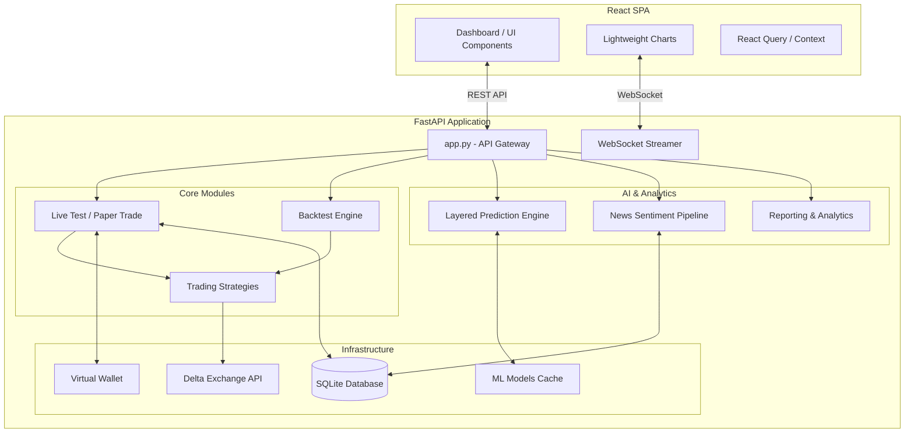

# BTCUSD Project Architecture & Technical Report

## 1. Overview
The BTCUSD system is an advanced, automated trading research suite designed for the cryptocurrency market (specifically BTC/USD). It is structured as a modern **Backend-Frontend Separation** architecture.
- **Backend:** A highly modular FastAPI application providing REST & WebSocket endpoints, acting as the brain for data ingestion, backtesting, paper trading, ML-based insights, and news sentiment analysis.
- **Frontend:** A React Single Page Application (SPA) built with Vite, delivering a modern, responsive, and data-rich dashboard for visualization and control.

---

## 2. Architecture Diagram

---

## 3. Directory Structure & Component Details

### `backend/`
The core logic of the system, written in Python.

- **`app.py`**: The main entry point. Initializes the FastAPI server, mounts REST/WebSocket routes, starts background scheduler tasks, and handles dependency injection.
- **`backtest/`**: 
  - `engine.py`, `execution.py`: Simulates historical trading data against strategy logic. Calculates slippage, portfolio metrics, and generates trade logs.
- **`database/`**: 
  - `db.py`: SQLAlchemy connection, session management, and schema definitions.
- **`insights/`**:
  - `layered_engine.py`, `prediction_engine.py`: Combines multiple machine learning models (LightGBM, Time-Series) to provide market direction and volatility forecasts.
- **`livetest/`**:
  - `manager.py`, `trade_manager.py`: Handles live (paper) trading execution, tracking active positions, mimicking exchange latency, and managing margin/leverage logic.
- **`models/`**:
  - Contains serialized machine learning artifacts (e.g., `.pkl`, `.joblib`) and caching folders used by the AI engines.
- **`NEWS/`**:
  - `fetchers/`: Scrapes/RSS parses data from CoinDesk, CoinTelegraph, Yahoo.
  - `sentiment/`: FinBERT integration to derive bullish/bearish signal scores.
  - `routes/`, `services/`: Endpoints and background schedulers for automated news ingestion.
- **`report/`**:
  - `manager.py`, `analytics.py`, `charts.py`: Aggregates backtest & live test results, computing metrics like Sharpe Ratio, Drawdown, and generating exportable JSON/CSV files.
- **`strategies/`**:
  - `base_strategy.py`: Abstract base class.
  - `simple_sma.py`, `candle.py`, `new_strategy.py`: Concrete algorithm implementations dynamically loaded by the backend.
- **`tools/`**:
  - Utility scripts for model training (`train_model.py`) and data preprocessing.
- **`utils/`**:
  - `delta_api.py`, `groq_client.py`, `logger.py`: Helpers for 3rd-party API connections, centralized logging, and formatting.
- **`wallet/`**:
  - `manager.py`: Manages the virtual paper-trading balance, processing deposits, withdrawals, and tracking PnL allocations.
- **`logs/`**:
  - Stored runtime log files generated by `backend/utils/logger.py`.
- **`static/`**:
  - Legacy static assets (HTML/JS/CSS) preserved for backward compatibility.
- **`scratch/` & `results/` & `screenshots/`**:
  - Development playgrounds, debug outputs, and generated UI artifacts.

### `frontend/`
The presentation layer, written in JavaScript/React.

- **`src/`**: Source code containing React components, hooks, and API service wrappers.
- **`public/`**: Static assets for the React build (favicon, robots.txt).
- **`package.json`**: NPM dependencies and run scripts (`npm run dev`, `npm run build`).
- **`vite.config.js`**: Bundler configuration optimized for rapid development.

### `Root Directory`
- **`.env`**: Environment variables (API keys, config flags).
- **`.gitignore`**: Git exclusions (virtual environments, secrets, node_modules).
- **`requirements.txt`**: Python dependency list.
- **`README.md`**: Quickstart guide for developers.

---

## 4. Key Workflows

### Backtesting Pipeline
1. Client selects a strategy and historical date range via React UI.
2. `app.py` passes parameters to `backtest/engine.py`.
3. Historical data is requested via `utils.delta_api.py`.
4. The strategy processes OHLCV data to emit Buy/Sell signals.
5. The `report/manager.py` computes metrics and stores the result as JSON in `report/backtest_reports/`.

### Live Paper Trading Pipeline
1. Client configures leverage, lot size, and initiates live trading.
2. `livetest/manager.py` runs a background task polling the live market ticker.
3. Every interval, the selected strategy inside `strategies/` evaluates conditions.
4. If a trade executes, margin is deducted via `wallet/manager.py`.
5. Positions are updated in real-time, streamed via WebSocket to `frontend/`.

### AI & News Sentiment Pipeline
1. Background schedulers periodically scrape RSS feeds (`NEWS/fetchers/`).
2. Text goes through `NEWS/sentiment/finbert_analyzer.py` for NLP processing.
3. Results are saved to `database/`.
4. `insights/layered_engine.py` combines these scores with technical price action models.
5. A consolidated directional forecast is exposed to the UI dashboard.
